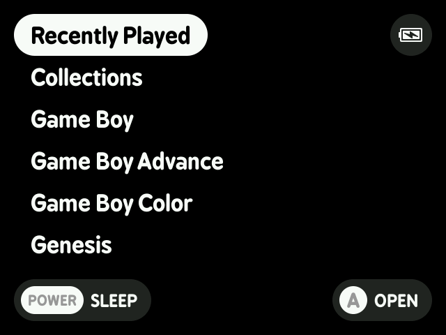
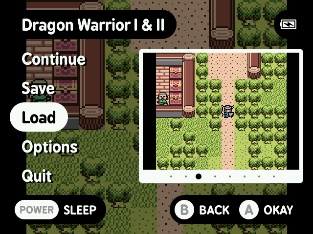

# MinUI

MinUI is a focused, custom launcher and libretro frontend for [a variety of retro handhelds](#supported-devices).

  

## Features

- Simple launcher, simple SD card
- No settings or configuration
- No boxart, themes, or distractions
- Automatically hides hidden files
  and extension and region/version 
  cruft in display names
- Consistent in-emulator menu with
  quick access to save states, disc
  changing, and emulator options
- Automatically sleeps after 30 seconds 
  or press POWER to sleep (and wake)
- Automatically powers off while asleep
  after two minutes or hold POWER for
  one second
- Automatically resumes right where
  you left off if powered off while
  in-game, manually or while asleep
- Resume from manually created, last 
  used save state by pressing X in 
  the launcher instead of A
- Streamlined emulator frontend 
  (minarch + libretro cores)
- Single SD card compatible with
  multiple devices from different
  manufacturers

You can [grab the latest version here](https://github.com/shauninman/MinUI/releases).

> Devices with a physical power switch
> use MENU to sleep and wake instead of
> POWER. Once asleep the device can safely
> be powered off manually with the switch.

## Supported consoles

Base:

- Game Boy
- Game Boy Color
- Game Boy Advance
- Nintendo Entertainment System
- Super Nintendo Entertainment System
- Sega Genesis
- PlayStation

Extras:

- Neo Geo Pocket (and Color)
- Pico-8
- Pokémon mini
- Sega Game Gear
- Sega Master System
- Super Game Boy
- TurboGrafx-16 (and TurboGrafx-CD)
- Virtual Boy

## Supported Devices

| Device | Added | Status |
| -- | -- | -- |
| Anbernic RG28xx | MinUI-20240429b-2 | Maintained |
| Anbernic RG35xx | MinUI-20230922b-2 | Deprecated |
| Anbernic RG35xx Plus | MinUI-20240106b-0 | Maintained |
| Anbernic RG35xxH | MinUI-20240120b-1 | Maintained |
| Anbernic RG35xxSP | MinUI-20240525-0 | Maintained |
| Anbernic RG40xxH | MinUI-20240717-1 | Maintained |
| Anbernic RG40xxV | MinUI-20240831-0 | Maintained | 
| Anbernic RG CubeXX | MinUI-202401028-0 | Active | 
| GKD Pixel | MinUI-20240120b-1 | Deprecated |
| M17 | MinUI-20231126b-2 | Maintained |
| MagicX XU Mini M | MinUI-20240831-0 | Maintained | 
| Miyoo A30 | MinUI-20240705-0 | Maintained |
| Miyoo Mini | MinUI-20230922b-2 | Deprecated |
| Miyoo Mini Plus | MinUI-20230922b-2 | Deprecated |
| Powkiddy RGB30 | MinUI-20231014b-1 | Deprecated |
| Trimui Brick | MinUI-20241028-0 | Active |
| Trimui Smart | MinUI-20230922b-2 | Deprecated |
| Trimui Smart Pro | MinUI-20231111b-2 | Maintained |

> [!NOTE]
> **Active** actively working on compatibility and improvements specific to this device  
> **Maintained** inheriting improvements to common functionality  
> **Deprecated** will be retired in a future update  
> **Retired** removed from repo, no longer updated or packaged with new releases  

## Legacy versions

The original Trimui Model S version of MinUI (2021/04/03-2021/08/06) has been archived [here](https://github.com/shauninman/MinUI-Legacy-Trimui-Model-S).

The sequel, MiniUI for the Miyoo Mini (2022/04/20-2022/10/23), has been archived [here](https://github.com/shauninman/MiniUI-Legacy-Miyoo-Mini).

The return of MinUI for the original Anbernic RG35XX (2023/02/26-2023/03/26) has been archived [here](https://github.com/shauninman/MinUI-Legacy-RG35XX).