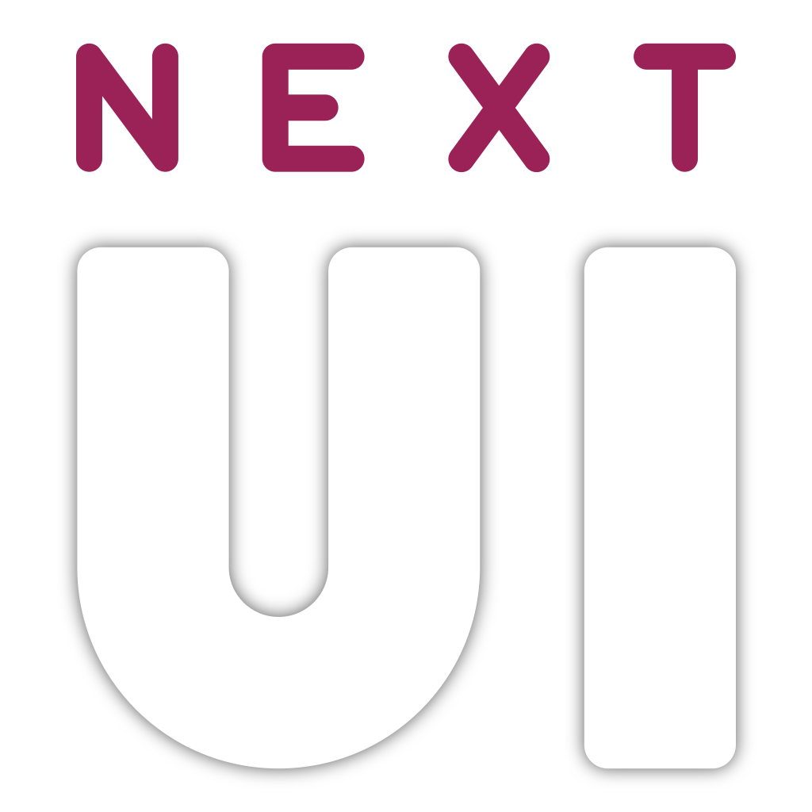

  

<h4 align="center">
  <a href="https://nextui.loveretro.games/getting-started/" target="_blank">Installation Guide</a>
  ·
  <a href="https://nextui.loveretro.games/docs/" target="_blank">Documentation</a>
  ·
  <a href="https://discord.gg/HKd7wqZk3h" target="_blank">Discord</a>
</h4>

    
    
    
    
    

---

A CFW based of MinUI with a rebuild emulation engine and tons of added features for the TrimUI Brick and Smart Pro. 

For other devices we recommend checking out [MinUI](https://github.com/shauninman/MinUI)

- Fixed both screen tearing and sync stutter problems of MinUI by rebuilding the emulator engine core
- Game switcher menu (Onion OS style) by [@frysee](https://github.com/frysee)
- High audio quality, due to advanced resampling engine using [libsamplerate](https://github.com/libsndfile/libsamplerate) (with quality/performance setting per emulator)
- Much lower latency (average 20ms, 1 frame of 60fps)
- Shaders!
- Game art/media support
- Game time tracker!
- Cheats support
- Integrated WiFi
- Overlays support!
- Dynamic cpu speed scaling (keeps your device cool and extends battery life, but gives the performance right when needed)
- Fully GPU OpenGL based for faster performance
- Custom bootlogos contributed by [@SolvalouArt](https://bsky.app/profile/solvalouart.bsky.social)
- Color and font settings to customize the NextUI interface
- Menu animations
- LED control, change colors, effects, brightness
- LED indicators, low battery, stand by, charging (brightness can be set seperately)
- Haptic feedback in the menu by [@ExonakiDev](https://github.com/exonakidev)
- Ambient LED mode, the LEDS act like Ambient light TV's for extra immersion, configurable per emulator
- Display controls (color temperature, brightness, contrast, saturation, exposure)
- Support for automatic NTP time synchronization with timezones and realtime clock (RTC)
- Deep Sleep mode, gives instant ON and avoids the overheat bug on the Brick by [@zhaofengli](https://github.com/zhaofengli)
- Battery Monitoring including history graph and time left prediction
- Scrolling animated titles for longer game names
- Updated and optimized build emulation cores
- Rumble strength fixed and is now variable as used by the games
- FBNeo Arcade screen rotation
- PAL Mode
- Next font supports CJK for JP/CN etc rom names
- Lot of other smaller fixes and optimizations

---

## Currently supported devices:
- Trimui Brick
- Trimui Smart Pro

---

## Future plans roadmap

- Bluetooth and wifi integrated
- Configurable FN and switch buttons
- More compatibility testing with different emulators and fix/improve if nessecary
- Retroachievements
- Probably we think of a lot of other stuff a long the way to add :D
- Once everything is to my liking I will look into porting this to more devices
- Clean up all MinUI code and strip it from all stuff for legacy devices etc.

---

## Installing

Follow our [installation guide](https://nextui.loveretro.games/getting-started/).

---

## How to use

While in menu:

- Hold `start` and press `volume up` or `volume down` to adjust brighness
- Hold `select` and press `volume up` or `volume down` to adjust color temperature
- Short press `select` to open the game switcher

While in game:

- `Menu` opens in game options menu, adjusting controls, scaling and what not
- Hold `menu` and `select` at same time to open up the game switcher

Deep sleep:

When the device is left idle it will enter light sleep. Light sleep turns the screen off and pulses the leds 5 times.

After two minutes the device will go into deep sleep. The leds will turn completely off.

---

## What about X feature?

NextUI supports a variety of optional extras called Paks.

These Paks introduce a variety of new features and emulators.

Our community has currated a [list of favorite Paks](https://nextui.loveretro.games/paks/community-favorites/) and a [list of standalone emulators](https://nextui.loveretro.games/paks/standalone-emulators/).

---

## Credits

[@josegonzalez](https://github.com/josegonzalez) for [minui-keyboard](https://github.com/josegonzalez/minui-keyboard/t)

---

## Play Retro's review of NextUI

##  Retro Handhelds' coverage of NextUI

---

## For all other info visit our website: [nextui.loveretro.games](https://nextui.loveretro.games)
